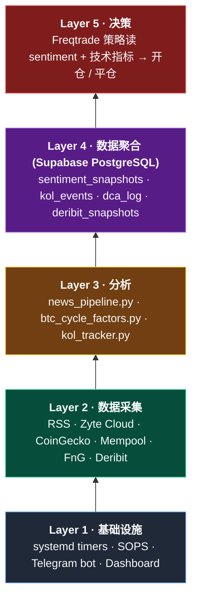

# Crypto Quant Trading System

> 一个开源的加密货币量化交易系统 —— 覆盖趋势跟随策略、情绪因子、链上指标、智能 DCA、期权监控、风险管理与告警。
> **开箱即用但非"一键致富"**：代码为研究与学习用途，实盘前请完整阅读 [docs/](docs/) 与 [TUTORIAL_FOR_BEGINNERS.md](TUTORIAL_FOR_BEGINNERS.md)。

[](LICENSE)
[](https://www.python.org)
[](https://www.freqtrade.io)

---

## ⚠️ 免责声明

- 本仓库**仅供教育与研究用途**。加密货币交易有高风险，可能损失全部本金。
- 所有策略参数、回测结果、架构决策基于作者个人风险偏好（现货为主、不加杠杆），未必适合你。
- **不要**在不理解代码的前提下实盘运行。请先用 `dry-run` 模式跑至少 2 个月。
- 作者不对因使用本代码造成的任何盈亏负责。

---

## ✨ 核心特色

- **经过 Stage 1-3 验证的趋势策略** —— `HonestTrend` 家族在 4 个独立时间窗口均正收益（walk-forward 4/4），out-of-sample +13% vs 市场 -13.9%
- **资产分工（Phase A/B, 2026-04-22 采纳）** —— BTC 走 DCA 累积；ETH/BNB/SOL 走趋势策略（spot long + futures long/short 对冲）
- **多时间框架过滤 (MTF)** —— 1m 信号 + 4h regime gate，减少震荡期假信号
- **12 个 BTC 估值指标** —— Pi Cycle, Power Law, 200W MA, Mayer Multiple, Ahr999, Ahr999x, Stock-to-Flow, Rainbow Band, Bubble Index, 4-Year MA, MVRV, NVT
- **智能 DCA 双通道** —— 时间驱动（周一定投 0.0-3.0×）+ 事件驱动（WebSocket 闪崩实时加仓），共享执行层
- **Deribit 期权监控** —— 自动扫描 BTC 看跌期权，按年化收益+流动性排序推送 CSP 候选
- **多源情绪聚合** —— Zyte Cloud 爬虫 + RSS + Google News + KOL 追踪 (Trump/Musk/BlackRock)
- **风险管理三件套** —— DD 15% PAUSE / DD 20% RETIRE，自动 kill-switch，Telegram 告警
- **SOPS 加密密钥** —— 所有 API key / token 用 GPG 加密存仓库，CI 友好
- **Supabase 统一数据层** —— 本地/Deepnote/CamberCloud 读写同一个 PostgreSQL
- **Dashboard** —— Chart.js 可视化实时行情 + 策略状态

---

## 📁 项目结构

```
freqtrade-strategies/
├── README.md                    ← 你在这里
├── TUTORIAL_FOR_BEGINNERS.md    ← 零基础速成教程（推荐先读）
├── LICENSE
│
├── strategies/                  ← Freqtrade 策略代码
│   ├── HonestTrendGeneric.py    ← 基类（所有 HonestTrend* 继承）
│   ├── HonestTrend15mDry.py     ← 15m spot long-only（A5：ETH/BNB/SOL）
│   ├── HonestTrend1mMTF.py      ← 1m 多时间框架 spot long-only
│   ├── HonestTrend1mLive.py     ← 1m 实盘候选（旧 BTC/ETH/BNB，未切 A5）
│   ├── HonestTrendFutures.py    ← futures long+short（Phase B 对冲，1x 杠杆）
│   ├── btc_cycle_factors.py     ← 12 个 BTC 估值指标
│   ├── dca_executor.py          ← 智能 DCA 执行引擎（周/事件共用）
│   ├── event_dca_bot.py         ← 事件驱动 DCA daemon（WebSocket 闪崩监听）
│   ├── deribit_monitor.py       ← 期权 CSP 监控
│   ├── news_pipeline.py         ← 情绪聚合
│   ├── kol_tracker.py           ← KOL 事件追踪
│   └── risk_manager.py          ← 风控 kill-switch
│
├── configs/                     ← Freqtrade 配置
│   ├── config_dryrun_honest15m.json
│   ├── config_dryrun_honest1mmtf.json
│   ├── config_live_honest1m.json
│   └── backtest/                ← 回测专用配置
│
├── docs/                        ← 技术文档
│   ├── HONEST_TREND_REPORT.md   ← 策略完整验证报告 (Stage 1-3)
│   ├── DRYRUN_HANDBOOK.md       ← 日常操作手册
│   ├── IMPLEMENTATION_PLAN.md   ← 系统架构演进
│   ├── STRATEGY_REPORT.md       ← 策略技术细节
│   ├── BACKTEST_RESULTS.md      ← 回测结果汇总
│   ├── FACTOR_DESIGN.md         ← 因子设计文档
│   ├── GO_LIVE_CHECKLIST.md     ← 实盘前检查清单
│   ├── OPTIMIZATION_PLAN.md     ← 优化路线图
│   └── STRATEGY_REPORT_v2.md
│
├── supabase/                    ← PostgreSQL 数据层
│   ├── supabase_schema_dca.sql
│   └── supabase_schema_deribit.sql
│
├── scripts/                     ← 工具脚本
│   ├── start_honest_trend.sh    ← 启动 HonestTrend bot
│   ├── risk_monitor.py          ← 风控检查 + kill-switch
│   ├── walk_forward_check.py    ← 滚动窗口验证
│   ├── generate_backtest_viz.py ← Dashboard 数据生成
│   ├── supabase_sql.sh          ← Supabase 管理 API 包装
│   └── check_timers.sh          ← systemd timer 健康检查
│
├── dashboard/                   ← Chart.js 可视化
├── crypto_scraper/              ← Scrapy Cloud 爬虫项目
│
├── secrets.env                  ← SOPS 加密（PGP）
├── secrets.yaml                 ← SOPS 加密（PGP）
├── .sops.yaml                   ← SOPS 规则
│
└── 顶层脚本
    ├── start_bot.sh             ← 启动 freqtrade bot（通用）
    ├── start_live.sh            ← 启动实盘（有安全检查）
    ├── start_reactor.sh         ← 启动事件反应器
    ├── run_pipeline.sh          ← 运行情绪聚合流水线
    ├── run_camber.sh            ← 提交 CamberCloud 作业
    ├── emergency_stop.sh        ← 紧急停机（黑天鹅响应）
    └── load_secrets.sh          ← 加载 SOPS 密钥到环境变量
```

---

## 🔧 先决条件

| 组件 | 版本 | 用途 |
|------|------|------|
| [Freqtrade](https://www.freqtrade.io) | 2025.x | 交易框架 |
| Python | 3.11+ | 运行策略与脚本 |
| [SOPS](https://github.com/getsops/sops) | 3.12+ | 密钥加密 |
| [age](https://github.com/FiloSottile/age) 或 GPG | — | SOPS 后端 |
| PostgreSQL | — | 通过 [Supabase](https://supabase.com)（免费） |
| systemd | user-level | 定时任务（Linux） |
| Telegram Bot | — | 告警 + 每日报告 |

可选：
- [Zyte Scrapy Cloud](https://www.zyte.com)（学生免费） — 爬虫托管
- [Deepnote](https://deepnote.com) — Notebook 云备份
- [CamberCloud](https://cambercloud.com) — 免费 GPU

---

## 🚀 快速开始

### 1. 克隆仓库与安装依赖

```bash
git clone https://github.com/<you>/freqtrade-strategies.git
cd freqtrade-strategies

# 安装 freqtrade（兄弟目录）
git clone https://github.com/freqtrade/freqtrade.git ../freqtrade
cd ../freqtrade && python -m venv .venv && source .venv/bin/activate
pip install -e . && cd -
```

### 2. 配置密钥

```bash
# 生成 GPG key（如没有）
gpg --full-generate-key

# 把你的 fingerprint 填入 .sops.yaml
vim .sops.yaml

# 创建 secrets.env 模板
cp secrets.env.example secrets.env
sops encrypt -i secrets.env

# 编辑（会用 $EDITOR 打开解密后的临时文件）
sops secrets.env
```

`secrets.env` 应包含：
```
SUPABASE_URL=https://<your-project-ref>.supabase.co
SUPABASE_KEY=<anon-key>
SUPABASE_MGMT_TOKEN=sbp_<your-pat>
TELEGRAM_BOT_TOKEN=<from-BotFather>
TELEGRAM_CHAT_ID=<your-chat-id>
BINANCE_API_KEY=<live-trading-only>
BINANCE_API_SECRET=<live-trading-only>
```

### 3. 初始化 Supabase 数据表

```bash
export SUPABASE_PROJECT_REF=<your-ref>
./scripts/supabase_sql.sh --file supabase/supabase_schema_dca.sql
./scripts/supabase_sql.sh --file supabase/supabase_schema_deribit.sql
```

### 4. 跑 dry-run 验证

```bash
./scripts/start_honest_trend.sh dryrun    # 15m spot long-only, port 8082
./scripts/start_honest_trend.sh mtf       # 1m MTF spot long-only, port 8083
./scripts/start_honest_trend.sh futures   # 15m futures long+short, port 8084
./scripts/start_honest_trend.sh all       # 三个并行
```

UI: http://localhost:8082 (dryrun) / http://localhost:8083 (mtf) / http://localhost:8084 (futures)

### 5. (可选) 启用 systemd 定时任务

参考 [docs/IMPLEMENTATION_PLAN.md](docs/IMPLEMENTATION_PLAN.md) 里的 timer 模板：
- `crypto-pipeline.timer` — 每 4h 跑情绪聚合
- `crypto-alerts.timer` — 每 30min 检查 KOL 新闻
- `crypto-daily-report.timer` — 每天 08:00 Telegram 汇总
- `crypto-deribit.timer` — 每天 18:00 (SGT) 推送 CSP 候选
- `crypto-dca.timer` — 每周一 执行智能 DCA（base $500 × 0.0-3.0×）
- `crypto-event-dca.service` — always-on daemon，WebSocket 闪崩实时加仓
- `crypto-risk-monitor.timer` — 每 4h 跑风控检查

---

## 🏗️ 系统架构



详见 [docs/IMPLEMENTATION_PLAN.md](docs/IMPLEMENTATION_PLAN.md)。

---

## 📊 策略总览

### HonestTrend 家族（Phase A/B 采纳后）

| 策略 | Timeframe | 市场 | 方向 | Pairs | Port | 状态 |
|------|-----------|-----|------|-------|-----:|------|
| `HonestTrend15mDry` | 15m | spot | long-only | ETH/BNB/SOL | 8082 | Dry-run（Phase A） |
| `HonestTrend1mMTF` | 1m+4h | spot | long-only | ETH/BNB/SOL | 8083 | Dry-run（Phase A） |
| `HonestTrendFutures` | 15m | **futures** | **long+short** | ETH/BNB/SOL | 8084 | **Dry-run（Phase B）** |
| `HonestTrend1mLive` | 1m | spot | long-only | BTC/ETH/BNB | 8081 | 旧配置，未切 A5 |

**全历史对比（2020-09 → 2026-04）**：

| 策略 | Profit | Max DD | Calmar |
|------|-------:|-------:|------:|
| BTC+ETH spot long (老) | +75% | 11.85% | 4.60 |
| A5 spot long (ETH/BNB/SOL) | +166% | 14.77% | 9.45 |
| **Futures L+S (Phase B)** | **+157%** | **7.84%** | **18.72** |

**W5 2022 LUNA 窗口**：spot long −17% → futures L+S **+48%**（short leg tail-hedge）。

- **入场（long）**：EMA 快线上穿慢线 + ADX > 18 + 成交量确认 + FnG < 80
- **入场（short, futures）**：EMA 死叉 + minus_di > plus_di + ADX > 18 + **FnG < 70**（不空 euphoria）
- **出场**：EMA 反向穿越
- **止损**：spot 无止损（信号驱动）；futures **−8% 硬止损**
- 详见 [docs/PHASE_B_FUTURES_SHORT.md](docs/PHASE_B_FUTURES_SHORT.md)

### 辅助模块

- **Smart DCA 双通道**：
  - **周定投** (`dca_executor.py` + `crypto-dca.timer`) — 基于周期因子 50% + FnG 30% + KOL 20%，乘数 **0.0-3.0×**
  - **事件 DCA** (`event_dca_bot.py` + `crypto-event-dca.service`) — WebSocket 实时监听，FLASH / FAST / SUSTAIN / CAPITUL 四层信号触发加仓
  - 两通道共用执行层，预算独立（周 $500 base / 月 $2000 event reserve）
- **Deribit Monitor** (`deribit_monitor.py`) — Phase 1 只读，扫描 5-30 天 / 10-30% OTM 的 BTC 看跌期权，按年化+流动性排序
- **Risk Manager** (`risk_manager.py`) — DD/PF 监控 + 自动 pause/retire + Telegram 告警

---

## 🔐 密钥管理 (SOPS)

所有密钥通过 [SOPS](https://github.com/getsops/sops) + GPG 加密存储在仓库中：

```bash
# 查看
sops decrypt secrets.env

# 编辑
sops secrets.env

# 在脚本里加载
eval "$(sops exec-env secrets.env 'env')"
# 或
source load_secrets.sh
```

`.gitignore` 阻止任何明文泄漏（`*.plaintext`、`.env`、`secrets.yaml.plaintext`）。

---

## 📥 历史数据下载

两种方式：

**方式 A · ccxt REST（freqtrade 默认）**
```bash
freqtrade download-data --exchange binance \
  --pairs BTC/USDT ETH/USDT \
  --timeframes 1m 15m 1h 4h 1d \
  --timerange 20170817-
```
慢（1m × 5 年 ≈ 30 分钟）但实时到当前 K 线。

**方式 B · data.binance.vision 批量（推荐长历史）**
```bash
# 从 2017-08 到当前月，自动 fallback 到 daily 补足未归档的当前月
scripts/download_bulk_binance.sh BTCUSDT 1m 2017-08
scripts/download_bulk_binance.sh ETHUSDT 1h 2017-08

# 指定范围
scripts/download_bulk_binance.sh SOLUSDT 15m 2020-08 2024-12
```
- 从官方每月归档的 ZIP 拉 + SHA256 校验
- 无 rate limit，BTC 1m × 9 年 ≈ 2 分钟
- 当前月自动 fallback 到 daily 分片
- 解压 → CSV → 转 feather → 合并到 `user_data/data/binance/<BASE>_<QUOTE>-<TF>.feather`（与 freqtrade 原生位置兼容）

## 🧪 回测与验证

```bash
# 单次回测（Phase A 山寨 spot long）
freqtrade backtesting \
  --config configs/backtest/config_backtest_15m_alts_a5.json \
  --strategy HonestTrend15mDry \
  --timerange 20200801-20260421

# Phase B futures long+short 回测
freqtrade backtesting \
  --config configs/backtest/config_backtest_15m_futures_a5.json \
  --strategy HonestTrendFutures \
  --timerange 20200914-20260421

# 8-regime walk-forward（2017-2026 跨 8 个市场 regime）
python scripts/walk_forward_full_history.py \
  --strategy HonestTrend15mDry \
  --timeframe 15m \
  --config configs/backtest/config_backtest_15m_alts_a5.json

# Event DCA 回测（验证暴跌加仓 vs 纯周定投）
python scripts/backtest_event_dca.py

# 生成 dashboard 可视化数据（Stage 3）
python scripts/generate_backtest_viz.py
```

验证方法论详见 [docs/HONEST_TREND_REPORT.md](docs/HONEST_TREND_REPORT.md) 的 Stage 1-3 章节。

## 📈 可视化

完整的策略交互式可视化套件：

```bash
# 1. 先跑一次带 --export signals 的 backtest
freqtrade backtesting \
  --strategy HonestTrend15mDry \
  --config configs/backtest/config_backtest_15m_btceth.json \
  --datadir user_data/data/binance \
  --user-data-dir user_data \
  --timerange 20170817- \
  --export signals

# 2. 生成 7 张自定义 plotly HTML 图
python scripts/visualize_strategy.py --out reports/my_run

# 3. freqtrade 内置图（总收益 / 价格标注交易点）
freqtrade plot-profit --strategy HonestTrend15mDry [...]
freqtrade plot-dataframe --strategy HonestTrend15mDry --pairs BTC/USDT [...]

# 4. 表格分析（exit 原因 / 入场标签聚类）
freqtrade backtesting-analysis --analysis-groups 0 2 5 --analysis-to-csv
```

`scripts/visualize_strategy.py` 输出：
- `01_equity_curve.html` — 资金曲线 + 回撤叠加
- `02_drawdown.html` — 滚动回撤，高亮最差日
- `03_per_pair.html` — 每个对的总利润 / 胜率 / 交易数
- `04_trade_distribution.html` — 利润分布直方图、时长直方图、散点图、20-trade 滚动均值
- `05_monthly_heatmap.html` — 月度 P&L 热力图（一眼看出哪个月好哪个月坏）
- `06_exit_reasons.html` — 出场原因的盈利贡献
- `07_rolling_winrate.html` — 10 / 30 / 60-trade 滚动胜率
- `index.html` — 综合仪表盘（关键指标卡片 + 图表索引）

截图 + 解读见 [docs/VISUALIZATION_GUIDE.md](docs/VISUALIZATION_GUIDE.md)。

---

## 📚 文档索引

| 文档 | 读者 | 内容 |
|------|------|------|
| [TUTORIAL_FOR_BEGINNERS.md](TUTORIAL_FOR_BEGINNERS.md) | **零基础** | 11 节速成教程：概念 / 本质 / 踩坑 / 架构 / 风控 / 避坑 / FAQ / 术语表 |
| [docs/HONEST_TREND_REPORT.md](docs/HONEST_TREND_REPORT.md) | 策略开发者 | Stage 1-3 验证完整报告 |
| [docs/DRYRUN_HANDBOOK.md](docs/DRYRUN_HANDBOOK.md) | 运维 | 日常操作 / 告警 / 排查 |
| [docs/IMPLEMENTATION_PLAN.md](docs/IMPLEMENTATION_PLAN.md) | 架构师 | 系统演进 & systemd timer 模板 |
| [docs/GO_LIVE_CHECKLIST.md](docs/GO_LIVE_CHECKLIST.md) | 实盘前 | 必读检查清单 |
| [docs/FACTOR_DESIGN.md](docs/FACTOR_DESIGN.md) | 量化研究 | 12 个 BTC 估值因子设计 |
| [docs/BACKTEST_RESULTS.md](docs/BACKTEST_RESULTS.md) | 所有 | 历史回测结果快照 |
| [docs/WALK_FORWARD_FULL_HISTORY.md](docs/WALK_FORWARD_FULL_HISTORY.md) | 策略研究 | 2017-2026 跨 regime walk-forward（8 窗口, 6/8 正收益）|
| [docs/VISUALIZATION_GUIDE.md](docs/VISUALIZATION_GUIDE.md) | 所有 | 7 张 plotly + 2 张 freqtrade 官方图，逐图解读 |
| [docs/EXPERIMENTS_DCA_AND_PYRAMID.md](docs/EXPERIMENTS_DCA_AND_PYRAMID.md) | 策略优化 | DCA 激进方案 + Pyramid Winners 实验（+78% / +41% 收益提升）|
| [docs/HYPEROPT_PYRAMID_TUNING.md](docs/HYPEROPT_PYRAMID_TUNING.md) | 策略优化 | Hyperopt 100-epoch 调优 pyramid 参数（+12 ppt, DD 减 1.4 ppt, OOS 验证）|
| [docs/PHASE_B_FUTURES_SHORT.md](docs/PHASE_B_FUTURES_SHORT.md) | 策略优化 | Phase B 期货 L+S 对冲设计与回测（W5 LUNA 从 −17% 翻 +48%）|
| [docs/EVENT_DCA.md](docs/EVENT_DCA.md) | 策略优化 | 事件驱动 DCA daemon（WebSocket 闪崩检测，混合策略 BTC 获取率 +6.4%）|
| [docs/RETIRED_STRATEGIES.md](docs/RETIRED_STRATEGIES.md) | 历史 | 14+ 个退役策略的失败原因与教训（避免重复踩坑） |

---

## 🛠️ 贡献

欢迎 issue / PR。特别欢迎：
- 新的**经过 walk-forward 验证**的策略（只提交有 Stage 1-3 报告的）
- 新的数据源接入（保证免费/低成本）
- 文档改进、教程翻译

**不接受**：
- 没有 out-of-sample 验证的"神策略"
- 引入付费依赖（改善现有方案除外）
- 不带测试的代码

---

## 📄 License

MIT License — 详见 [LICENSE](LICENSE)。

---

## 🙏 致谢

本项目构建在这些优秀开源项目之上：

- [Freqtrade](https://www.freqtrade.io) — 加密货币量化交易框架
- [Supabase](https://supabase.com) — 开源 Firebase 替代
- [SOPS](https://github.com/getsops/sops) — Secrets 加密
- [Scrapy](https://scrapy.org) — 爬虫框架
- [Chart.js](https://www.chartjs.org) — 前端可视化

方法论参考：

- Nassim Taleb — 反脆弱 / 黑天鹅
- Andrew Lo — Adaptive Markets Hypothesis
- Ernest Chan — Quantitative Trading

---

> **最重要的一句话**：在量化里，**生存**比**赚钱**重要十倍。活到下一个牛市的人，才有资格赚钱。
