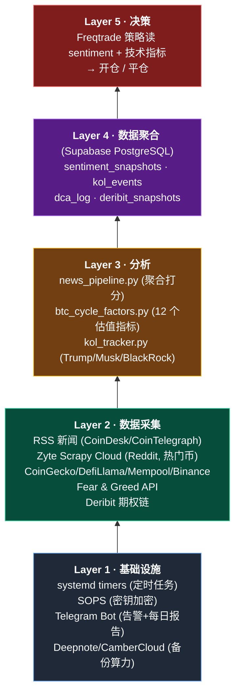

# 加密量化交易入门 — 给程序员朋友的速成教程

> 写给：懂代码，但对金融/交易零基础，想搞清楚"量化交易到底是怎么回事"的朋友。
> 基于实际踩坑经验，不是教科书。

---

## 目录

1. [先搞懂几个基本概念](#1-先搞懂几个基本概念)
2. [量化交易的本质](#2-量化交易的本质)
3. [我们踩过的坑（你不用再踩）](#3-我们踩过的坑你不用再踩)
4. [真正 work 的东西长什么样](#4-真正-work-的东西长什么样)
5. [完整系统架构](#5-完整系统架构)
6. [风险管理（最重要）](#6-风险管理最重要)
7. [从哪里开始做](#7-从哪里开始做)
8. [避坑清单](#8-避坑清单)
9. [FAQ 常见问题](#9-faq-常见问题)
10. [心理准备](#10-心理准备)
11. [附录 A：本项目开源架构速览](#附录-a本项目开源架构速览)
12. [附录 B：术语速查表](#附录-b术语速查表)

---

## 1. 先搞懂几个基本概念

### 1.1 什么叫策略（Strategy）

策略 = 一组规则，规定**什么时候买、什么时候卖**。

最简单的策略：
```
当价格连续 3 天上涨，买入。
当价格连续 3 天下跌，卖出。
```

这就是一个策略。复杂度可以无限叠加（加指标、加过滤器、加仓位管理），但本质都是规则。

### 1.2 什么叫回测（Backtest）

回测 = 把策略"倒带"到历史数据上跑一遍，看过去 3 年如果用这套规则，会赚还是会亏。

**陷阱**：回测漂亮不代表未来赚钱。90% 的"回测神策略"实盘都亏钱（见第 3 节）。

### 1.3 什么叫时间周期（Timeframe）

价格在不同尺度下看起来不一样：
- **1 秒 K 线** — 高频交易员看的
- **1 分钟 K 线** — 短线
- **15 分钟 / 1 小时** — 中短线
- **日线 / 周线** — 中长线
- **月线** — 长线投资

越短的周期：交易越频繁，手续费成本越高，噪音越多，赚钱越难。
越长的周期：交易越少，回撤期可能很长（几个月不赚钱），但噪音少，机构优势小。

**新手建议**：从日线或 4 小时开始，别碰 1 分钟以下。

### 1.4 什么叫滑点（Slippage）和手续费

- **手续费**：每买卖一次，交易所收你 0.05%~0.1%（Binance 现货 0.1%）
- **滑点**：你想以 $100 买，但你下单的瞬间价格跳到 $100.5，你实际多花了 0.5%

**一次来回交易**：进场 0.1% + 出场 0.1% + 2 次滑点 ≈ 0.3% 成本。

如果你的策略平均每笔只赚 0.2%，你**没算成本时看似赚钱，实际在亏**。新手最大的错觉就是这个。

### 1.5 什么叫过拟合（Overfitting）

你用历史数据反复调参数，直到回测收益看起来特别好。但那些参数只是"死记硬背"了历史的噪音，未来根本不工作。

类比：考试时不学原理，只背往年题答案。新题一来就傻眼。

**判断是否过拟合**的核心：**Walk-forward 验证**（下面会讲）。

### 1.6 量化评判指标速查（一句话版）

这些指标第 3-4 节会反复出现，先扫一眼混个眼熟。

**收益类：**

- **PF（Profit Factor）**：总盈利 ÷ 总亏损，>1 才算赚钱，>1.3 算有 edge（真实策略通常 1.2-1.5，>3 大概率过拟合）。
- **总收益 / CAGR**：跑完一段时间赚了百分之多少（CAGR 是年化版本）。
- **Win Rate（胜率）**：赚钱的交易占比——趋势策略 30-45% 也能赚（大赢小亏），均值回归可能 60%+ 但单笔小。

**风险类：**

- **Max Drawdown（最大回撤，DD）**：账户从最高点跌到最低点亏了多少百分比——决定你心脏够不够用，也是止损阈值。
- **Kurtosis（峰度）**：收益分布有多"胖尾"，正态分布 = 3，>5 就是极端事件多（我们策略 10.55 就是胖尾严重，均值失真）。

**风险调整收益（把收益除以波动/回撤）：**

- **Sharpe**：每承担 1 单位总波动能换多少超额收益，业界通用——真实策略 0.5-1.5，>2 开始怀疑过拟合。
- **Sortino**：Sharpe 的改良版，只算下行波动（涨的波动不扣分），更贴近交易者直觉。
- **Calmar**：年化收益 ÷ 最大回撤，专给趋势策略看——>2 不错，>10 红旗。

**统计显著性（证明"不是运气"）：**

- **Bootstrap**：把历史交易有放回抽样 10000 次，看 PF 的 95% 置信区间——区间下沿 >1 才叫"统计证实有 edge"。
- **Permutation test**：随机打乱交易顺序生成对照组，看你的真实 PF 是否落在前 5%（p<0.05 = 不是瞎蒙出来的）。
- **Wilcoxon 检验**：不假设正态分布的"非参数 t 检验"，金融胖尾数据用它比 t-test 靠谱，判断"单笔收益中位数是否 >0"。
- **p-value**：上面这些检验的输出，<0.05 = "随机凑出这个结果的概率 <5%"，可作为 edge 存在的弱证据。

**实战口诀**：单看 PF/Sharpe 容易被过拟合骗，一定要配合 **Max DD + Walk-forward + Bootstrap CI** 三件套。

### 1.7 交易市场与订单类型速查

**交易品种（你在买什么）：**

- **现货 (Spot)**：直接持有实体币，最多亏 100%（币归零）——量化策略打底、长期持有用这个。
- **永续合约 (Perpetual / Perp)**：带杠杆的价差赌博，24/7 可开多/空，爆仓即归零——**散户坟墓，别碰**。
- **交割合约 / 期货 (Futures)**：有到期日的杠杆品种，机构对冲用，加密圈少见，散户略过。
- **期权 (Options)**：买"在未来某价格交易的权利"——做卖方 (CSP) 可赚权利金，本项目 Deribit 模块就是这个。

**订单类型（你怎么下单）：**

- **市价单 (Market)**：立刻按市场当前最优价成交——稳成交但吃滑点。
- **限价单 (Limit)**：指定价挂单等人来吃——无滑点但可能不成交，**量化必用**。
- **止损单 (Stop-loss)**：价格触到 X 自动触发市价/限价卖出——硬止损用。
- **跟踪止损 (Trailing Stop)**：止损价随盈利自动上移——"让赢家跑"同时锁利。
- **冰山单 (Iceberg)**：大额拆成小单分批成交，不露底——散户用不到。
- **OCO (One-Cancels-Other)**：同时挂止盈+止损，一单成交自动撤另一单——仓位自动管理用。

**新手规则**：只用现货 + 限价单，其他等一年以后再说。

### 1.8 Hyperopt 是什么（自动调参）

**Hyperopt = Hyperparameter Optimization（超参数优化）**。你策略里有一堆数字需要调：EMA 周期选 50 还是 200？止损 3% 还是 5%？ADX 门槛 18 还是 25？手动试太慢，Hyperopt 让电脑自动搜索。

**4 种常见搜索方法，各一句话：**

- **Grid Search（网格搜索）**：把每个参数切成 N 格，暴力跑完所有组合——参数多就组合爆炸（5 参数 × 10 格 = 10 万次回测）。
- **Random Search（随机搜索）**：在参数空间随机采样 N 次——比网格快，经验上同样好甚至更好。
- **Bayesian Optimization（贝叶斯优化）**：用代理模型预测"下一组参数大概多好"，往好方向探索——Freqtrade 的 `hyperopt` 命令默认就是这个（基于 Scikit-Optimize）。
- **Genetic Algorithm（遗传算法）**：把参数组合当"基因"，好的"交配繁殖"、差的淘汰——能跳出局部最优但慢。

**Freqtrade Hyperopt 实战：**
```bash
freqtrade hyperopt \
  --strategy HonestTrend1mLive \
  --hyperopt-loss SharpeHyperOptLoss \
  --spaces buy sell \
  --epochs 500 \
  --timerange 20230101-20250101
```
它会搜索你策略里用 `IntParameter / DecimalParameter` 标记的参数，返回 Sharpe 最大的一组。

**Hyperopt 陷阱（整个量化最容易翻车的地方）：**

1. **过拟合噩梦**：Epoch 越多越危险，模型会死记训练集噪音。"最优参数"通常在新数据上最烂。
2. **目标函数陷阱**：选错 loss（`ShortTradeDur` / `OnlyProfit`）= 鼓励策略频繁/激进交易。建议用 `SharpeHyperOptLoss` 或 `CalmarHyperOptLoss`。
3. **参数空间太宽**：给的搜索范围太大，它一定能"找到"一组漂亮数字——但是碰巧。
4. **没做 walk-forward**：只在一个时间段 hyperopt → 结果就是那段的过拟合。
5. **没设 `--spaces` 限制**：一次调所有参数（buy/sell/stoploss/roi），维度爆炸。

**防过拟合的正确姿势：**

- 先用**逻辑 + 回测**确定策略骨架，再 hyperopt **2-3 个**核心参数（不是 20 个）
- 参数边界给合理范围（例：EMA 50-200，不是 1-1000）
- Epoch 控制在 100-500，不要上千
- **必须做 walk-forward**：在 2020-2022 hyperopt，2023 test；再 2021-2023 hyperopt，2024 test……跨窗口都 work 才算真有效
- 拿到结果看**参数稳定性**：最优附近 ±5% 是不是也差不多好？如果是悬崖 = 过拟合
- 好参数的 out-of-sample 性能 ≥ in-sample 的 70%，否则丢弃

**一句话总结**：Hyperopt 是把双刃剑——用好了帮你微调，用错了给你"完美过拟合的垃圾策略"。**稳健 > 最优**。

---

## 2. 量化交易的本质

### 2.1 你在赚谁的钱？

交易是**零和博弈**（准确说加手续费是负和）。你赚的每一分都是别人亏的。所以必须回答：

> 我凭什么比对手强？

常见的"优势"（edge）来源：
1. **速度**：高频做市，毫秒级执行 — 你作为散户**不可能**比机构快
2. **信息**：比市场更快知道新闻 — 可能，但很难
3. **成本**：手续费低于别人 — 机构优势
4. **模型**：用统计方法找出市场的系统性偏差 — **散户的机会在这里**
5. **心理**：别人贪婪时你恐惧 — 反向交易，可行

### 2.2 散户最现实的 3 种 edge

基于这 2 年踩坑总结：

**Edge 1：趋势跟随**
- 价格起趋势后跟上，反转前离场
- 赢面：30-45% 胜率，但赢的时候赚 3-5 倍
- 关键：**让赢家跑，快速砍亏损**

**Edge 2：情绪反转（Contrarian）**
- 市场极度恐慌时加仓，极度贪婪时减仓
- 基于 Fear & Greed Index 等指标
- 这个 edge 有统计验证（见我们项目的 backtest）

**Edge 3：事件驱动**
- Trump 发推文 / Musk 发推文 / 监管消息
- 需要**比新闻快**（监控价格异动，而不是等新闻）
- 有实际效果但执行很难（见第 5 节架构）

### 2.3 什么在加密圈**没用**（别浪费时间）

- ❌ **技术指标堆砌**：RSI + MACD + 布林带 + ... 叠加，过拟合必死
- ❌ **大量特征 ML 模型**：50 个特征 1000 条数据，纯过拟合
- ❌ **Chat 群里的"内幕"**：99% 是 pump & dump，你是韭菜
- ❌ **杠杆交易**：除非你是职业，否则爆仓是必然
- ❌ **频繁交易**：手续费会吃掉大部分盈利

---

## 3. 我们踩过的坑（你不用再踩）

### 坑 1：相信漂亮的回测

我们试过一个策略 `SentimentUltimate`：
- **In-sample**：PF 6.86, Calmar 50
- **Out-of-sample**：PF 1.05

**什么意思？**
- In-sample（样本内）= 训练数据 = 回测数据
- Out-of-sample（样本外）= 策略没见过的数据

PF（Profit Factor）= 总盈利 / 总亏损，>1 才赚钱
Calmar = 收益 / 最大回撤

**50 的 Calmar 是天文数字**（巴菲特一辈子 Calmar 才 2-3）。这就是过拟合的红旗。

真实的 edge 大概是：PF 1.2-1.5，Calmar 2-5。如果你看到 PF > 3 或 Calmar > 10，99% 是过拟合。

### 坑 2：ML 万能论

我们试了一堆 ML 模型，每个一句话讲它在干啥：

- **LightGBM**：一堆"if-else 决策树"叠在一起投票，微软出品，快——给它特征（RSI、成交量…）它告诉你"涨/跌"。
- **XGBoost**：和 LightGBM 同类（梯度提升树），老牌，工程上更稳，Kaggle 比赛神器；对我们而言就是 LightGBM 的堂兄。
- **PyTorch MLP**：最基础的神经网络，一层层全连接节点，把输入数字映射到"涨跌概率"——能拟合非线性但样本少就记噪音。
- **Transformer**：ChatGPT 底层那套注意力机制，用来在时序里找"哪根 K 线影响未来"——本来为 NLP 设计，K 线数据量远远不够它发挥。
- **强化学习 PPO / A2C**：让 agent 在模拟市场里自己"试错交易"，赚了加分亏了扣分，慢慢学策略——听起来很酷，实际在金融里极易过拟合回测环境。

**结果**：全部在 out-of-sample 失效。

**原因**：
- 加密数据样本太小（每日线 5 年 ≈ 1800 个样本）
- 特征太多（50+ 个），模型直接记忆噪音
- Regime change：市场结构会变，训练时的规律未来不适用

**结论**：除非你有强领域知识支持的特征，否则 ML 在这里就是玩具。

### 坑 3：过度依赖回测

Sentiment 策略的回测显示 +103% 利润。但：
- Sentiment 数据是**实时**的，历史数据没有
- 回测时用"当前 sentiment"代替"历史 sentiment" = 回测结果不真实

**教训**：依赖非 OHLCV 数据的策略**无法公平回测**，只能 dry-run。

### 坑 4：忽视实盘和回测的差距

- 回测：完美成交价
- 实盘：滑点 0.1-0.3%，特别是夜里流动性差时
- 回测：没有崩溃、API 断线、交易所维护
- 实盘：各种意外

**教训**：回测收益乘 0.7 才是实盘预期。

### 坑 5：Hyperopt 过度优化（真实案例）

我们的 `SentimentUltimate` 策略跑 1000 epoch Hyperopt 调 8 个参数：
- **In-sample**：PF 6.86、Sharpe 3.2 — 看起来像神
- **Out-of-sample**：PF 1.05 — 基本打回原形
- 把"最优参数"改动 ±5%：收益直接从 +300% 变 -40%

**为什么**：1000 epoch × 8 参数的搜索空间足够大，**必然**能找到一组参数**恰好**在训练集拟合到噪音。但噪音不会重现。

**教训**（详见 §1.8 Hyperopt 陷阱）：
- 参数应该"大概有用"而不是"精确最优"——稳健 > 最优
- 永远配 walk-forward 验证
- 调 2-3 个核心参数就够，不要一次调 10 个

---

## 4. 真正 work 的东西长什么样

基于 Stage 1-3 严格验证后留下的策略：

### 4.1 `HonestTrend1mLive` — 纯技术趋势跟随

```
入场：EMA(1410) 上穿 EMA(2085) + ADX > 18 + 成交量确认 + FnG < 80
出场：EMA(1410) 下穿 EMA(2085)
止损：无（信号驱动退出）
```

**为什么叫 "Honest"**：没有花哨的指标堆砌，只有 2 条均线 + 1 个趋势强度过滤器 + 1 个情绪防御规则。

**Out-of-sample 表现**（2025-07 ~ 2026-04）：
- +13% vs 市场 -13.9%（alpha +27%）
- PF 1.52
- 最大回撤 7.78%
- 胜率 45%

**关键**：这个策略 out-of-sample 测试了 4 个独立时间窗口都正收益（walk-forward 4/4）。

### 4.2 Stage 1-3 验证流程（核心方法论）

我们验证策略的流程，**任何新策略都应该走一遍**：

**Stage 1 — 参数稳定性**
- 固定其他参数，改动一个参数，看结果是否连续变化
- 结果应该：好参数附近都差不多好（鲁棒）
- 红旗：最优参数是悬崖（稍微改一下就从 +100% 变 -50%）= 过拟合

**Stage 2 — 跨时间尺度一致性**
- 同样的策略信号，用不同 timeframe（1m / 15m / 1h）分别测
- 如果只有一个 timeframe 能跑通，其他都亏 = 巧合
- 真 edge 应该跨 timeframe 都有效

**Stage 3 — 统计显著性**
- Bootstrap：把交易结果重采样 10000 次，看 PF 的 95% 置信区间是否 > 1
- Permutation test：打乱交易顺序，看原始 PF 是否在随机分布的 top 5%
- Wilcoxon 检验：非参数检验（金融数据有胖尾，t 检验不可靠）

**我们 SentimentTrend 策略 Stage 3 结果**（真实数据，别觉得差）：
- Bootstrap PF 95% CI: [0.89, 2.65] — **跨过了 1，edge 未被统计证明**
- Kurtosis 10.55 — 极端胖尾（正态 = 3）
- 中位数收益 -0.60% — 大多数交易亏钱
- 靠少数大赢家拉起来

**诚实结论**：大多数策略 Stage 3 都过不了。但这不代表不能做，只意味着要：
1. 用小仓位
2. 有严格的 kill-switch
3. 持续验证，随时准备退役

---

## 5. 完整系统架构

我们最终建成的系统，分 5 层：



### 5.1 为什么分这么多层

**不是过度设计**，每一层有明确的理由：

- **基础设施层** — 密钥不能硬编码（SOPS），定时任务比 cron 好管（systemd），Telegram 告警比看日志快
- **数据层** — 多源才能在一个源挂时不停摆；Zyte 爬 RSS 爬不到的（如 Reddit 用户 IP block 会被封）
- **分析层** — 分离"采集"和"分析"，方便替换。KOL tracker 单独一个模块，不和趋势策略耦合
- **数据库** — Supabase 是**单一数据源**。所有平台（本地/Deepnote/CamberCloud）都读写同一个库，不用同步文件
- **策略层** — 只负责"看数据 → 决策"，不管数据怎么来的

### 5.2 定时任务节奏

```
每 30 分钟:  crypto-alerts       KOL 新闻 + bot 健康检查
每 4 小时:  crypto-pipeline     sentiment 全链路 + 爬虫
每 4 小时:  crypto-risk-monitor DD/PF 风控检查
每天 08:00: crypto-daily-report 每日 Telegram 汇总
每天 18:00: crypto-deribit      期权 CSP 候选推送
每周日 03:00: crypto-backtest   walk-forward 再验证
每周一 08:00: crypto-dca         智能 DCA 买入
每月 1 号:   crypto-walkforward edge 衰减检测
```

### 5.3 用到的工具栈

| 工具 | 用途 | 为什么 |
|------|------|--------|
| **Freqtrade** | 交易框架 | 开源、Python、加密交易最成熟 |
| **Supabase** | PostgreSQL + REST API | 免费、无服务器运维 |
| **Zyte Scrapy Cloud** | 爬虫云平台 | 躲避反爬、学生免费 |
| **Deepnote** | Notebook 云 | 数据分析 + 备份执行 |
| **CamberCloud** | 算力云 | 免费 GPU，可跑 ML |
| **SOPS + GPG** | 密钥加密 | 所有密码加密存仓库 |
| **systemd timer** | 定时任务 | 比 cron 更可观测 |
| **Telegram Bot** | 通知 | 即时告警 |

---

## 6. 风险管理（最重要）

### 6.1 塔勒布的反脆弱原则

塔勒布在《黑天鹅》《反脆弱》里讲的原则，适用于交易：

**原则 1：Barbell 仓位（杠铃结构）**
- 90% 资金放最安全的地方（BTC 长持 + 稳定币）
- 10% 放高风险策略（可以归零）
- **不要中等风险**（最差的选择）

**原则 2：限制下行，不限上行**
- 最大亏损固定（硬止损或总仓位上限）
- 盈利可以无限大（让趋势跑）

**原则 3：不要加仓亏损**
- Martingale（加仓摊低成本）= 反脆弱反面
- 正确做法：盈利加仓，亏损砍仓

**原则 4：预设 kill-switch**
- 回撤到 X% 必须停止（不是"如果"，是"必须"）
- 我们的规则：
  - DD 15% → PAUSE（暂停开新仓）
  - DD 20% → RETIRE（策略退役，人工审查才能恢复）

### 6.2 仓位管理

**100K USDT 分配示范**：
```
50K (50%) 长期 BTC 现货持有        ← 核心，不动
20K (20%) 稳定币理财 (Binance Earn) ← 无风险打底
15K (15%) HonestTrend 量化策略     ← 经过 walk-forward 验证的
10K (10%) 智能 DCA (FnG 加权)      ← 系统性加仓
 5K ( 5%) 实验性策略 (期权 / 共振) ← 可以全亏
```

**关键**：
- 不要 100% 投量化策略
- 不要为"一个好机会"重仓
- 每月 review，表现差的减仓，表现好的**保持**（不要加）

### 6.3 胖尾风险（Fat Tail）

加密市场每年都有 1-2 次 30%+ 单日暴跌。你必须假设明天就会发生。

**应对**：
- 不用杠杆（或最多 2x，且有止损）
- 不把生活必需的钱放进去
- 现货优先（可以扛住 -50% 等回来），永远不爆仓

### 6.4 仓位怎么算（别拍脑袋）

**方法 1：固定分数法 (Fixed Fractional)** — 最简单最推荐
```
单笔风险金 = 总资金 × 1~2%
仓位 = 单笔风险金 / (入场价 - 止损价) × 入场价
```
每笔只拿总资金 1-2% 去赌，亏了只亏 1%，稳。

**方法 2：凯利公式 (Kelly Criterion)** — 数学最优
```
f* = (p·b - q) / b
  p = 胜率,  q = 败率 (=1-p)
  b = 赢亏比 (平均盈利/平均亏损)
```
- 我们 HonestTrend：p=45%, b=3 → f* ≈ 27%
- **实操永远用 Half-Kelly / Quarter-Kelly**（÷2 或 ÷4）→ 13% 或 7%
- 原因：胜率估高 5% Kelly 就爆仓，留安全边际

**方法 3：波动率目标法 (Vol Targeting)** — 机构标配
```
仓位 = 目标年化波动 / 标的实际波动
```
标的波动大就自动减仓，波动小就加仓——让组合的风险贡献恒定。

**新手安全公式**（够用）：
- 单策略仓位 ≤ 总资金 20%
- 单笔最大亏损 ≤ 总资金 1%
- 所有风险策略总和 ≤ 总资金 30%

---

## 7. 从哪里开始做

### 7.1 新手 90 天路线图

**Day 1-30：不碰实盘，只学**
1. 装 Freqtrade，跑官方示例策略
2. 下载 2 年 BTC 日线数据，回测一个简单 EMA 策略
3. 读懂每个指标的输出（PF、Sharpe、DD、Calmar）
4. 理解什么是"胖尾"（看 BTC 历史几次大跌）

**Day 31-60：dry-run**
1. 选一个验证过的策略（如本项目的 `HonestTrend`）
2. 用 dry-run（模拟盘）跑 30 天
3. 每周对比 dry-run vs 回测，理解差距
4. 建立告警（Telegram bot）

**Day 61-90：实盘小额**
1. 10% 资金启动实盘（如 1000 USDT）
2. 按策略规则**严格执行**（不主观判断）
3. 每天记录：实际收益 / 预期收益 / 错过的信号
4. 3 个月后评估，决定是加仓还是退出

**不要**：
- 第一天就实盘
- 用信用卡或贷款资金
- 加杠杆
- 盯盘（日线策略看一周一次就够）

### 7.2 学习资源（按优先级）

1. **Freqtrade 官方文档** — https://www.freqtrade.io/en/stable/
2. **塔勒布《反脆弱》** — 风险管理底层原理
3. **Andrew Lo 《Adaptive Markets》** — 为什么市场规律会变
4. **Ernest Chan 《Quantitative Trading》** — 量化入门经典
5. **Twitter 上 @macrocephalopod, @CryptoHayes, @wclementeiii** — 但只看不跟

**别看**：
- 知识付费"量化大师课"
- 抖音/B站上"我用量化赚了 100 倍"
- Telegram 群的"内幕消息"

### 7.3 编程技能栈

你需要会：
- **Python**（策略、数据处理）
- **SQL**（数据库查询）
- **Shell / systemd**（自动化）
- **Git**（版本管理）

不需要会：
- Rust / C++（除非你搞 HFT）
- 深度学习框架（ML 在散户量化里用处有限）
- 前端框架（Dashboard 有 Chart.js 就够）

### 7.4 交易所与账户安全（真金白银前必读）

**选交易所：**

| 交易所 | 定位 | 备注 |
|--------|------|------|
| **Binance** | 散户首选 | 流动性最好、API 成熟、币种最全 |
| **Coinbase / Kraken** | 美区合规 | 费率高，KYC 严 |
| **OKX / Bybit** | 亚洲备胎 | 分散风险用 |
| **Deribit** | BTC/ETH 期权唯一靠谱所 | 本项目 CSP 策略用它 |
| ~~FTX~~ | 2022 倒了 | **提醒：永远不要把全部资产放一个交易所** |

**API Key 安全清单（每条都要做）：**
- ✅ **IP 白名单**绑定你的服务器 IP
- ✅ 只勾选**读取 + 交易**权限，**严禁提现**
- ✅ 开启 2FA（Google Authenticator，**不要用短信**，SIM swap 风险）
- ✅ 密钥用 SOPS / age 加密存仓库，**绝不硬编码**
- ✅ 每 3-6 个月轮换一次密钥
- ❌ 永远不发在群里 / 截图里 / GitHub 上（有扫描机器人实时收割）

**资金分层存放：**
- **交易所热钱包**：只放当前交易仓位的钱（比如 10-20%）
- **硬件钱包 (Ledger/Trezor)**：10K-100K 级别的长期持有
- **多签钱包 (Safe{Wallet})**：100K 以上，2-of-3 或 3-of-5 签名

**金句**：不是你的私钥，就不是你的币 (Not your keys, not your coins)。

---

## 8. 避坑清单

按犯错频率排序：

1. ❌ **重仓实盘一个没 walk-forward 过的策略**
   - 先 dry-run 2 个月

2. ❌ **用 Hyperopt 过度优化参数**
   - 最多改 2-3 个关键参数，其他用默认

3. ❌ **看回测 Sharpe > 2 就兴奋**
   - 真实 edge 的 Sharpe 通常 0.5-1.5

4. ❌ **把策略参数改来改去追逐短期表现**
   - 有效 edge 需要坚持至少 3 个月才看得出

5. ❌ **听信新闻做交易**
   - 当新闻发布时，信息已经 price in 了

6. ❌ **用杠杆**
   - 除非你每天能盯盘 16 小时，否则爆仓是迟早的

7. ❌ **把所有鸡蛋放一个策略**
   - 至少 3 个不同风格的策略组合

8. ❌ **忽略手续费和滑点**
   - 回测乘以 0.7 才是实盘预期

9. ❌ **情绪化干预策略**
   - 系统说买你不买，系统说卖你不卖 = 你不需要系统

10. ❌ **不做记录**
    - 每笔交易为什么买、为什么卖、结果如何、学到什么

---

## 9. FAQ 常见问题

**Q1：只有几千块值得做量化吗？**
值得学、不值得赌。本金太小时手续费 + 滑点会吃掉 edge。先 dry-run + 看盘学习，本金攒到 1-2 万再开小仓实盘。

**Q2：Python 不熟能做吗？**
能。最低要求：看得懂别人策略、会改参数、读得懂回测输出。真正自己写策略需要熟练 pandas + numpy。

**Q3：量化一年能赚多少才算正常？**
现实数字：优秀 15-30%，顶尖 40-60%，100%+ 靠运气且一般下一年回吐——别信"月赚 30%"的任何广告。

**Q4：要 24 小时盯盘吗？**
好的系统化策略每天看 5 分钟够了。盯盘等于没有系统，心理一介入就破坏规则。

**Q5：策略什么时候退役？**
任一条触发即退役：
- 连续 3 个月跑输 walk-forward 预期 > 50%
- 回撤突破设定 kill-switch 阈值（我们是 20%）
- 市场 regime 明显改变（牛转熊 / 引入新的衍生品结构）
- 同类 edge 被广泛公开（套利消失）

**Q6：回测多久才算够？**
至少覆盖一个完整牛熊周期（加密 ≥ 4 年），跨 2-3 种市场状态（趋势/震荡/崩盘）。只回测牛市 2020-2021 是自欺欺人。

**Q7：可以直接用 GitHub 上的开源策略吗？**
学习可以，上实盘不行。公开的 edge 都被套利掉了。正确做法：学它的结构 → 自己改参数 → 用自己数据重新 walk-forward → 用自己 kill-switch → 才敢上小仓。

**Q8：税怎么办？**
视所在地，**必问当地 CPA**：
- 中国大陆：政策灰色，自己掂量
- 新加坡：个人长期交易免税，短线频繁可能被判营业收入
- 美国：IRS 严查 crypto，每笔交易都要报（Form 8949）
- 香港：个人资本利得免税
别为省税省出大麻烦。

**Q9：遇到黑天鹅（如 312、LUNA）怎么办？**
事前：kill-switch 预设、不杠杆、仓位分层——准备好就不怕。
事中：按规则执行（不临时决策）。
事后：复盘是否触发 kill-switch，是否要调整参数（不是改策略，是改风控）。

**Q10：实盘和 dry-run 差距大怎么办？**
正常。常见原因：
- 滑点（回测乘 0.7）
- API 限流导致错过信号
- 挂单没成交（限价单打不到）
- 时钟漂移 / 服务器延迟
解决：记录每个差异、找根因，不要盲目调参数。

---

## 10. 心理准备

量化交易的**真相**：

- 大部分月份收益平平
- 偶尔几个月大赚（靠大 trend）
- 偶尔几个月大亏（心理压力巨大）
- 年化 15-30% 已经是优秀了
- 想年化 100%+？99% 的人最终归零

**最重要的一句话**：

> 在量化里，**生存**比**赚钱**重要十倍。

能活到下一个牛市的人，才有资格赚钱。

---

## 附录 A：本项目开源架构速览

所有代码和配置在：`~/Documents/github/public/freqtrade-strategies/`

```
strategies/
  HonestTrend1mLive.py     ← 经过验证的趋势策略
  HonestTrend15mDry.py     ← 并行 dry-run 验证
  HonestTrend1mMTF.py      ← 多时间框架版
  news_pipeline.py         ← sentiment 数据聚合
  kol_tracker.py           ← Trump/Musk 等 KOL 识别
  btc_cycle_factors.py     ← 12 个 BTC 估值指标
  dca_executor.py          ← 智能 DCA 执行器
  deribit_monitor.py       ← 期权 CSP 候选监控
  risk_manager.py          ← 风控 kill-switch

configs/
  config_backtest_*.json   ← 回测配置
  config_dryrun_*.json     ← 模拟盘配置
  config_live_*.json       ← 实盘配置

dashboard/                 ← 可视化 Dashboard (Chart.js)
crypto_scraper/            ← Scrapy 项目 (Zyte Cloud)
scripts/                   ← 工具脚本
```

**完整文档**：
- `docs/HONEST_TREND_REPORT.md` — 策略完整验证报告（Stage 1-3）
- `docs/DRYRUN_HANDBOOK.md` — 日常操作手册
- `docs/IMPLEMENTATION_PLAN.md` — 系统架构演进

---

## 附录 B：术语速查表

通读本教程时随手查。

**市场与行情：**

| 术语 | 一句话解释 |
|------|-----------|
| OHLCV | Open/High/Low/Close/Volume，一根 K 线的 5 个数字 |
| Timeframe | K 线时间尺度（1m/5m/1h/1d） |
| Spread | 买一价 vs 卖一价的差，衡量流动性 |
| Bid / Ask | 买方最高出价 / 卖方最低要价 |
| Slippage | 下单意图价 vs 实际成交价的差 |
| Order Book | 订单簿，所有挂单的实时列表 |
| Liquidity | 流动性，能大额成交而不推动价格的能力 |
| Funding Rate | 永续合约多空之间每 8h 结算的费率 |
| Market Maker | 做市商，同时挂买单卖单吃价差 |

**交易与仓位：**

| 术语 | 一句话解释 |
|------|-----------|
| Long / Short | 做多（赌涨）/ 做空（赌跌） |
| Leverage | 杠杆，以小博大也以小亏大 |
| Position | 持仓，正=多头，负=空头 |
| Entry / Exit | 进场 / 出场 |
| Stop-loss / Take-profit | 自动止损 / 自动止盈 |
| Liquidation | 爆仓，杠杆仓位被强平 |
| PnL | Profit and Loss，盈亏 |
| Unrealized PnL | 浮动盈亏（未平仓） |
| Drawdown (DD) | 从账户最高点回撤的幅度 |

**策略与 edge：**

| 术语 | 一句话解释 |
|------|-----------|
| Strategy | 一组规则：何时买、何时卖 |
| Signal | 策略发出的"该买"或"该卖"事件 |
| Edge | 你相对市场的统计优势 |
| Alpha | 超越市场基准的超额收益 |
| Beta | 你的仓位与大盘同步程度 |
| Regime | 市场状态（牛/熊/震荡） |
| Backtest | 用历史数据模拟策略表现 |
| Dry-run / Paper trading | 模拟盘，真实行情但不下真单 |
| Live | 实盘，下真单 |
| Walk-forward | 用滚动窗口反复"训练-测试"防过拟合 |
| Overfitting | 过拟合，参数死记历史噪音 |
| Hyperopt | 自动搜索最佳策略参数（Freqtrade 内置，基于贝叶斯优化） |
| Grid / Random / Bayesian Search | 3 种参数搜索方法 |
| Genetic Algorithm | 遗传算法调参，模拟自然选择 |
| Hyperopt Loss | Hyperopt 的评分函数，决定"更好"怎么算 |

**期权（本项目 Deribit 模块用得到）：**

| 术语 | 一句话解释 |
|------|-----------|
| Call / Put | 看涨期权 / 看跌期权 |
| Strike | 行权价 |
| OTM / ATM / ITM | 虚值 / 平值 / 实值 |
| IV | Implied Volatility，隐含波动率 |
| Delta | 标的涨 1 美元，期权价格变化多少 |
| Theta | 每天时间价值流失多少 |
| Gamma | Delta 本身的变化速度 |
| Vega | IV 变化 1% 期权价格变化多少 |
| CSP | Cash-Secured Put，卖看跌期权赚权利金 |
| Premium | 期权权利金（卖方收到的） |

**链上 / 情绪指标：**

| 术语 | 一句话解释 |
|------|-----------|
| FnG | Fear & Greed Index，0-100 情绪值 |
| MVRV | 市值 / 已实现市值，链上估值 |
| NVT | Network Value / Transaction，类市盈率 |
| Mayer Multiple | 当前价 / 200 周 MA，估值指标 |
| Ahr999 | 李笑来提出的 DCA 择时指数 |
| Halving | 比特币减半，每 4 年一次 |
| Realized Price | 所有币最后一次链上移动时价格的加权平均 |

---

## 总结：如果你只记得一件事

**让时间成为你的朋友，而不是敌人**。

- 趋势跟随策略靠时间捕捉大行情
- DCA 靠时间摊低成本
- 风险管理靠时间让小 edge 复利
- 活下来的概率靠时间累积

**别追求一夜暴富。量化交易是马拉松，不是百米跑。**

祝好运。
