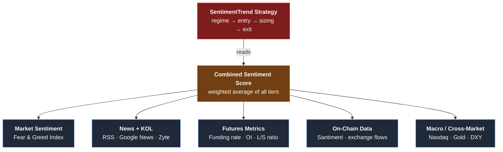

# Factor Design Document

## Overview

16 factors across 3 tiers, feeding into the SentimentTrend strategy.
14/16 are completely free with no API key required.

---

## Tier 1: Futures Market Microstructure (FREE, no key)

### Factor 1: Funding Rate
- **Source**: `GET https://fapi.binance.com/fapi/v1/fundingRate?symbol=BTCUSDT&limit=10`
- **Update**: Every 8 hours (Binance schedule)
- **Signal Logic**:
  - Rate < -0.01% → shorts overcrowded → **bullish** (squeeze risk)
  - Rate > 0.05% → longs overleveraged → **bearish** (correction risk)
  - -0.01% to 0.01% → neutral
- **Weight**: 0.15
- **Historical**: Available from 2019-09 via Binance API
- **Status**: [ ] Not implemented

### Factor 2: Open Interest (OI)
- **Source**: `GET https://fapi.binance.com/futures/data/openInterestHist?symbol=BTCUSDT&period=1d&limit=30`
- **Update**: Daily
- **Signal Logic**:
  - OI rising + Price rising → trend continuation → **bullish**
  - OI rising + Price falling → shorts building → **bearish**
  - OI falling + Price rising → short covering rally → **weak bullish** (not sustainable)
  - OI falling + Price falling → capitulation → **watch for bottom**
- **Weight**: 0.10
- **Historical**: Available from 2020 via Binance API
- **Status**: [ ] Not implemented

### Factor 3: Long/Short Account Ratio
- **Source**: `GET https://fapi.binance.com/futures/data/globalLongShortAccountRatio?symbol=BTCUSDT&period=1d&limit=30`
- **Update**: Daily
- **Signal Logic** (contrarian):
  - Retail heavily long (ratio > 2.0) → **bearish** (dumb money wrong)
  - Retail heavily short (ratio < 0.5) → **bullish** (dumb money wrong)
  - Also compare top traders vs retail for divergence
- **Weight**: 0.10
- **Historical**: Available from 2020 via Binance API
- **Status**: [ ] Not implemented

### Factor 4: Taker Buy/Sell Volume Ratio
- **Source**: `GET https://fapi.binance.com/futures/data/takerlongshortRatio?symbol=BTCUSDT&period=1d&limit=30`
- **Update**: Daily
- **Signal Logic**:
  - Ratio > 1.1 → aggressive buying → **bullish**
  - Ratio < 0.9 → aggressive selling → **bearish**
  - Trend of ratio matters more than absolute value
- **Weight**: 0.08
- **Historical**: Available from 2020 via Binance API
- **Status**: [ ] Not implemented

### Factor 5: Stablecoin Supply Change
- **Source**: `GET https://stablecoins.llama.fi/stablecoincharts/all?stablecoin=1` (USDT)
- **Update**: Daily
- **Signal Logic**:
  - USDT supply growing week-over-week → new money entering → **bullish**
  - USDT supply shrinking → money leaving crypto → **bearish**
- **Weight**: 0.07
- **Historical**: Available from 2020 via DefiLlama
- **Status**: [x] Partially implemented (total only, need per-stablecoin trend)

---

## Tier 2: Strategy Logic Enhancement (FREE, no key)

### Factor 6: BTC ETF Net Flows
- **Source**: KOL tracker (Google News) + dedicated RSS search
  - `https://news.google.com/rss/search?q=bitcoin+etf+inflow+OR+outflow`
- **Update**: Daily (when market is open)
- **Signal Logic**:
  - Consecutive inflow days → institutional accumulation → **bullish**
  - Large outflow → institutional distribution → **bearish**
  - BlackRock IBIT flow is the key indicator
- **Weight**: 0.10
- **Implementation**: LLM extracts flow numbers from news headlines
- **Status**: [ ] Not implemented (partially via KOL tracker)

### Factor 7: Options Market (Deribit)
- **Source**: `GET https://www.deribit.com/api/v2/public/get_book_summary_by_currency?currency=BTC&kind=option`
- **Update**: Real-time (poll every 4h)
- **Signal Logic**:
  - Put/Call OI ratio > 1.0 → hedging demand high → **cautious**
  - IV percentile > 80 → expect big move → **increase position sizing**
  - IV percentile < 20 → calm market → **decrease sizing**
  - Max pain at expiry → price tends to gravitate toward it
- **Weight**: 0.08
- **Historical**: Limited public history
- **Status**: [ ] Not implemented

### Factor 8: Multi-Timeframe (Weekly)
- **Source**: Binance OHLCV (already have)
- **Update**: Weekly candle close
- **Signal Logic**:
  - Weekly EMA21 > EMA55 → macro uptrend confirmed → allow entries
  - Weekly EMA21 < EMA55 → macro downtrend → block entries or reduce size
  - Only enter daily signals when weekly trend agrees
- **Weight**: Built into entry conditions (filter, not score)
- **Implementation**: Add `@informative('1w')` decorator in strategy
- **Status**: [ ] Not implemented

### Factor 9: Momentum Pair Rotation
- **Source**: OHLCV data (already have)
- **Update**: Weekly rebalance
- **Signal Logic**:
  - Rank all pairs by 20-day rate of change (ROC)
  - Only trade top N pairs (strongest momentum)
  - Blacklist pairs with negative momentum in downtrend
- **Weight**: Built into pair selection
- **Implementation**: Custom `PairList` handler or `confirm_trade_entry` filter
- **Status**: [ ] Not implemented

### Factor 10: Sentiment-Based Exit
- **Source**: Existing sentiment pipeline
- **Update**: Every pipeline run (4h)
- **Signal Logic**:
  - Current: exit only on EMA cross (can be very late)
  - New: also exit when FnG > 75 AND LLM says "sell" AND profit > 20%
  - Also: tighten trailing when greed detected
- **Weight**: Built into exit conditions
- **Implementation**: `custom_exit` callback in strategy
- **Status**: [ ] Not implemented

---

## Tier 3: On-Chain + Cross-Market (mostly FREE)

### Factor 11: Large BTC Transfers to Exchanges
- **Source**: `GET https://blockchain.info/q/24hrsbtcsent` + exchange address heuristics
- **Alternative**: News-based ("whale alert" detection in headlines)
- **Update**: Daily
- **Signal Logic**:
  - Large BTC moving to known exchange addresses → sell pressure → **bearish**
  - Large BTC moving from exchanges → accumulation → **bullish**
- **Weight**: 0.05
- **Status**: [ ] Not implemented

### Factor 12: Miner Capitulation Index
- **Source**: Mempool.space (already integrated)
- **Update**: Daily
- **Signal Logic**:
  - Hashrate drops > 10% in 2 weeks → miners capitulating → **bottom signal**
  - Difficulty ribbon inversion (fast MA < slow MA) → **strong buy**
  - Miner revenue declining but hashrate stable → stress building
- **Weight**: 0.05
- **Implementation**: Compute hashrate MA crossover from existing data
- **Status**: [ ] Not implemented (raw data exists)

### Factor 13: Cross-Market Correlation
- **Source**: Yahoo Finance (free, no key)
  - `https://query1.finance.yahoo.com/v8/finance/chart/{symbol}?interval=1d&range=30d`
  - Symbols: `^IXIC` (Nasdaq), `GC=F` (Gold), `DX-Y.NYB` (DXY)
- **Update**: Daily
- **Signal Logic**:
  - BTC-Nasdaq correlation > 0.7 → risk-on trade, follow stock market
  - BTC-Nasdaq correlation breaking down → crypto decoupling → own trend
  - DXY falling → dollar weakness → **bullish** for crypto
  - Gold rising + BTC rising → safe haven narrative → **bullish**
- **Weight**: 0.07
- **Historical**: Full history via Yahoo Finance
- **Status**: [ ] Not implemented

### Factor 14: UTXO Age Distribution (Hodler Behavior)
- **Source**: Blockchain.com API (free, basic metrics)
  - `GET https://blockchain.info/q/totalbc` (total BTC)
  - Long-term holder supply changes via news/LLM analysis
- **Update**: Weekly
- **Signal Logic**:
  - Old coins (>1yr) starting to move → long-term holders selling → **top signal**
  - Old coins dormant + price rising → strong hands holding → **bullish**
- **Weight**: 0.05
- **Status**: [ ] Not implemented

### Factor 15: Liquidation Cascades (NEEDS API KEY - OPTIONAL)
- **Source**: Coinglass API ($29/month)
- **Alternative**: News-based ("$X billion liquidated" detection)
- **Signal Logic**:
  - Large long liquidations → forced selling done → **bottom signal**
  - Large short liquidations → squeeze done → momentum may fade
- **Weight**: 0.05
- **Status**: [ ] Skip (use news detection as proxy)

### Factor 16: Social Sentiment Analytics (NEEDS API KEY - OPTIONAL)
- **Source**: Santiment API (free tier limited)
- **Alternative**: Already covered by Reddit scraping + KOL tracker + LLM
- **Signal Logic**:
  - Social volume spike → retail FOMO → **contrarian caution**
  - Developer activity rising → fundamental improvement → **bullish**
- **Weight**: 0.05
- **Status**: [ ] Skip (existing coverage sufficient)

---

## Weight Summary (all factors active)

| Category | Factors | Combined Weight | Source |
|---|---|---|---|
| Market Sentiment | FnG, LLM, News KW | 0.25 | Existing |
| KOL Impact | Trump/Musk/BlackRock/Fed | 0.15 | Existing |
| Futures Microstructure | Funding, OI, L/S, Taker | 0.20 | **NEW** (Tier 1) |
| Market Structure | CoinGecko, DeFi TVL, Stables | 0.10 | Existing |
| Options & Derivatives | Put/Call, IV | 0.05 | **NEW** (Tier 2) |
| On-Chain | Exchange flows, miners, UTXO | 0.10 | **NEW** (Tier 3) |
| Cross-Market | Nasdaq, Gold, DXY correlation | 0.05 | **NEW** (Tier 3) |
| Strategy Logic | Weekly TF, rotation, exit | N/A | **NEW** (Tier 2, filters) |

---

## API Key Requirements

| # | Factor | API Key Needed? | Cost |
|---|---|---|---|
| 1-4 | Binance Futures data | **NO** | Free |
| 5 | Stablecoin supply | **NO** | Free |
| 6 | ETF flows | **NO** | Free (news) |
| 7 | Deribit options | **NO** | Free |
| 8-10 | Strategy logic | **NO** | N/A |
| 11 | Exchange flows | **NO** | Free |
| 12 | Miner metrics | **NO** | Free |
| 13 | Cross-market | **NO** | Free |
| 14 | UTXO age | **NO** | Free |
| 15 | Liquidations | YES | $29/mo (skip) |
| 16 | Social analytics | YES | Limited free (skip) |

**Total new API keys needed: 0**

---

## Implementation Order

| Phase | Factors | Est. Time | Impact |
|---|---|---|---|
| Phase A | 1-4 (Binance Futures) | 2 hours | HIGH — strongest alpha |
| Phase B | 8, 10 (Weekly TF, sentiment exit) | 1 hour | HIGH — reduces losses |
| Phase C | 7 (Deribit options) | 1 hour | MEDIUM — sizing signal |
| Phase D | 5, 6 (Stablecoin, ETF flows) | 1 hour | MEDIUM — flow signals |
| Phase E | 9 (Momentum rotation) | 1 hour | MEDIUM — pair selection |
| Phase F | 11-14 (On-chain, cross-market) | 2 hours | LOW-MED — confirmation |

Start with Phase A (Binance Futures factors) — highest impact, easiest to implement.
