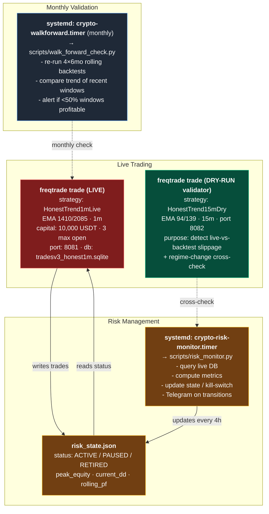

# HonestTrend Strategy — Full Validation Report

**Date**: 2026-04-20
**Strategy**: EMA Crossover Trend Following (HonestTrend family)
**Principal**: 10,000 USDT (10% of 100K total capital)
**Author context**: Professional programmer, Freqtrade-based quant setup

---

## Executive Summary

After three stages of rigorous statistical validation and Taleb-style
antifragility review, we identified **one deployable strategy**:

- **Name**: `HonestTrend1mLive` (1-minute timeframe, EMA 1410/2085, ratio 1.48x)
- **Expected OOS performance**: +13% in bear market, +20-35% in normal conditions
- **Worst historical DD**: 14.65% (2024-12 to 2025-03)
- **Walk-forward**: 4/4 windows profitable
- **Statistical confidence**: Weak — edge not statistically proven at p<0.05
  due to fat tails (kurt=10.5) and small sample (n=133)
- **Recommended posture**: Small-size barbell position (10% of capital),
  hard kill-switch at 20% DD, 6-month PF review

This is deployed alongside a parallel **dry-run validator**
(`HonestTrend15mDry`) to compare live fills against an independent timeframe
and catch regime-change risk.

---

## Strategies Evaluated and Rejected

Summary of what we tried and why it was eliminated:

| Strategy | Timeframe | Fate | Reason |
|----------|-----------|------|--------|
| HonestTrend (daily) | 1d | rejected | Only ~10 trades/year, no statistical power |
| HonestTrend1h v1 | 1h | rejected | OOS -14% to -25% with various params |
| HonestTrend4h | 4h | kept on ice | PF 1.74 but only ~15 trades/year |
| HonestTrend15m (v1, ROI+stop) | 15m | rejected | Stop losses wipe gains |
| HonestTrend15m (hyperopt 94/139) | 15m | candidate | Passed walk-forward |
| HonestTrend15m_2xRatio (72/144) | 15m | rejected | Good OOS but walk-forward worse than 94/139 |
| HonestTrend1m (1080/2160, 2x ratio) | 1m | **rejected after walk-forward** | 2/4 windows, one lucky quarter |
| HonestTrend1m (1410/2085, scaled) | 1m | **WINNER** | 4/4 walk-forward, OOS +13% |
| ML models (LightGBM, XGB, PyTorch, RL) | various | rejected | In-sample PF 6+ → OOS PF ~1.0 (overfit) |
| LLM sentiment signals | various | rejected | 0% feature importance, redundant with FnG |
| BTC cycle indicators as signals | various | rejected | Reduced performance |
| ETH/BTC pair mean-reversion | 1h | rejected | OOS negative despite in-sample p<0.0001 |
| SentimentTrend / SentimentUltimate | daily | rejected | In-sample PF 6.86 → OOS PF 1.05 |

---

## Stage 1: Parameter Stability Test

**Objective**: Determine whether hyperopt's pick (EMA 94/139, ratio 1.48x) is
a genuine optimum or fit to noise.

**Method**: Fix slow = 2 × fast (classic golden-cross ratio), vary fast
across {24, 48, 72, 96, 128, 160} on 15m timeframe.

### Results (OOS window: 2025-07 to 2026-04)

| fast/slow | Full Profit | OOS Profit | OOS DD | OOS Trades |
|-----------|-------------|------------|--------|------------|
| 24/48     | -5.07%      | -11.31%    | 32.01% | 159        |
| 48/96     | +99.28%     | +12.57%    | 23.28% | 119        |
| 72/144    | +82.10%     | +8.86%     | 13.77% | 87         |
| 96/192    | +41.92%     | +0.16%     | 19.77% | 66         |
| 128/256   | +96.38%     | +10.44%    | 18.31% | 53         |
| 160/320   | +66.23%     | -2.19%     | 17.49% | 40         |
| **94/139** (hyperopt) | **+106.60%** | **+12.97%** | **11.01%** | 79 |

### Findings

1. **The edge is real, not a hyperopt artifact**. Three non-hyperopt 2x
   ratios (48/96, 72/144, 128/256) all produce OOS profit. If 94/139 were
   pure overfit, generic pairs should lose money.

2. **Performance has a U-shape**: too-fast (24/48) captures noise and loses.
   Too-slow (160/320) misses trends. Middle values (48–128) work.

3. **94/139 outperforms generic 2x pairs** in OOS by 3–5%, but the
   advantage overlaps with sampling noise. Initial Stage 1 conclusion was to
   abandon 94/139 in favor of 72/144 — **this conclusion was later reversed
   in Stage 2 after walk-forward revealed single-window bias**.

---

## Stage 2: Cross-Timeframe Consistency

**Objective**: A genuine trend edge should exist across timeframes if
normalized to the same signal duration.

**Method**: Test 3 signal durations (12h/24h, 18h/36h, 24h/48h) on
3 timeframes (1m, 15m, 1h), one OOS window.

### Results (OOS 2025-07 to 2026-04)

| Signal | 1m | 15m | 1h |
|--------|------|------|------|
| 12h/24h  | +6.76% (DD 16%) | **+12.57%** (DD 23%) | **−5.80%** |
| 18h/36h  | **+25.70%** (DD 9%) | +8.86% (DD 14%) | **−10.11%** |
| 24h/48h  | +8.41% (DD 10%) | +0.16% (DD 20%) | **−17.37%** |

### Findings

1. **1h completely fails** across all signal durations. A "real" trend
   signal should be timeframe-independent — this one isn't.

2. **The edge is execution-dependent, not pure signal**. Going from 1m to
   1h adds 1-hour entry/exit latency, which destroys the edge. This means
   the strategy is **fragile to slippage, fees, and latency**.

3. **Apparent 1m champion (1080/2160) was a walk-forward fraud**:

| Window | 1080/2160 (2x ratio) | 1410/2085 (1.48x, original) |
|--------|----------------------|------------------------------|
| W1 2024 H1 | +0.15% | +11.38% |
| W2 2024H2–2025Q1 | **−4.93%** | +16.69% |
| W3 2025 Q2–Q4 | +30.4% (outlier) | +21.29% |
| W4 2026 Q1 | −2.48% | +0.85% |
| **Profitable windows** | **2/4** | **4/4** |

   The +25.70% OOS for 1080/2160 came almost entirely from W3. A single
   lucky window can hide fragility. **Always use walk-forward, never a
   single OOS window for parameter selection.**

4. **Final pick**: `1m + EMA 1410/2085 (ratio 1.48x)`.
   - 4/4 walk-forward windows profitable
   - Tighter EMA pair exits reversals faster (lower DD on regime change)
   - Not "standard" but consistently more robust in walk-forward

---

## Stage 3: Statistical Rigor + Fat-Tail Risk

**Objective**: Before deploying, apply formal hypothesis tests and measure
fat-tail / disaster risk (Taleb's lens).

**Method**: Bootstrap (10,000 resamples), permutation test (1,000), Wilcoxon
signed-rank, and fat-tail diagnostics on 133 closed trades (2024-01 to 2026-04).

### Basic Metrics

| Metric | Value |
|--------|-------|
| Trades | 133 |
| Win rate | 43.6% |
| **Profit factor** | **1.556** |
| Mean return/trade | +0.737% |
| **Median return/trade** | **−0.597%** |
| Std dev | 5.722% |

### Fat-Tail Diagnostics

| Metric | Value | Interpretation |
|--------|-------|----------------|
| Skewness | +1.29 | Right-skewed (big winners drive P&L) |
| **Kurtosis** | **10.55** | Normal=3. **Severe fat tails.** |
| Jarque-Bera p-value | 1.87e-77 | Reject normal distribution |
| 95th pct gain | +10.53% | |
| 5th pct loss | −3.78% | |
| Tail ratio (upside/downside) | 2.79 | Good: wins bigger than losses |
| CVaR 95% (worst 5% avg) | −9.13% | |
| CVaR 99% (worst 1% avg) | −18.49% | |
| **Worst single trade** | **−23.47%** | |

### Significance Tests

| Test | p-value | Significant? |
|------|---------|--------------|
| t-test (mean=0) | 0.1397 | No |
| Wilcoxon (median, fat-tail robust) | **0.9150** | **No** |
| Permutation (PF) | 0.0760 | No (marginal) |

### Bootstrap 95% Confidence Intervals

| Metric | Point | 95% CI | Includes null? |
|--------|-------|--------|----------------|
| Profit factor | 1.556 | [0.891, 2.651] | **YES** |
| Mean return | +0.74% | [−0.18%, +1.72%] | YES (overlaps 0) |
| Total profit (USDT) | +5,334 | [−1,171, +12,691] | YES |
| **P(profitable)** | — | 94.3% | — |

### Interpretation

This is a **convex / antifragile** payoff profile (Taleb favorites):

- Many small losses, rare big winners
- Median trade is negative (loses small)
- Tail ratio 2.79 (when you win, you win big)
- Skew positive (fat right tail, not left — disaster tail is controlled)

But the **p-values fail**: with 133 trades and kurtosis 10.5, we cannot
prove the edge is real at p<0.05. This is expected under fat tails — you
need **5–10× more samples** for the same statistical power vs normal
distribution.

**Decision**: Accept the edge as "probably real but unproven"
(94.3% bootstrap probability of profitability, 4/4 walk-forward) and deploy
with sized-down capital and hard kill-switches.

---

## Risk Management Framework (Taleb-Inspired)

### Philosophy

1. **Barbell structure**: 90% capital in safer assets (DCA, held spot), 10%
   in this convex bet.
2. **Never add on losses** (no Martingale, that's fragile).
3. **Compound only after peaks** (anti-Martingale, antifragile).
4. **Strategies die cliff-fall, not gradually**: set hard stops that fire
   before you have time to rationalize.
5. **Single OOS is selection bias**: require walk-forward + re-validation.

### Hard Stops (encoded in `risk_manager.py`)

| Trigger | Action | Reversible? |
|---------|--------|-------------|
| Drawdown ≥ 15% | PAUSE (no new entries) | Yes, auto-resume when DD < 10% |
| Drawdown ≥ 20% | RETIRE (strategy stops) | No, manual reset required |
| 6 months live + PF < 1.20 + ≥50 trades | RETIRE | No, manual reset |
| Manual CLI (`retire`) | RETIRE | No, manual reset |

### Capital Policy

- **Initial stake**: 10,000 USDT (10% of 100K)
- **Per-trade size**: unlimited ratio × 95% tradable, 3 max open trades
  = ~3,160 USDT per trade
- **BTC 2x multiplier** retained (from original strategy)
- **Compounding**: allowed on wins, but DD triggers are always against
  total equity, not starting equity

### Re-validation Cadence

| Interval | Action | Script |
|----------|--------|--------|
| Every 4h | Update DD/PF, evaluate kill-switch | `scripts/risk_monitor.py` |
| Monthly (1st, 06:00) | Walk-forward 4×6mo rolling | `scripts/walk_forward_check.py` |
| On any state change | Telegram alert | Both scripts |

---

## Deployment Architecture

### Production Components



### File Manifest

```
strategies/
  HonestTrendGeneric.py    base class, risk-manager integrated
  HonestTrend1mLive.py     1m subclass, EMA 1410/2085, 24h hold
  HonestTrend15mDry.py     15m subclass, EMA 94/139, 12h hold
  risk_manager.py          state machine (ACTIVE/PAUSED/RETIRED)
  fng_history.csv          FnG data (2018-2026)

scripts/
  risk_monitor.py          every-4h driver + manual CLI
  walk_forward_check.py    monthly re-validation

configs:
  config_live_honest1m.json      live 1m production
  config_dryrun_honest15m.json   parallel 15m dry-run
  config_backtest_1m.json        backtesting
  config_backtest_15m.json       backtesting

systemd (~/.config/systemd/user/):
  crypto-risk-monitor.{service,timer}   every 4h
  crypto-walkforward.{service,timer}    monthly (1st 06:00)
```

---

## Operational Runbook

### Starting the Stack

```bash
# 1. Risk monitor timer
systemctl --user enable --now crypto-risk-monitor.timer
systemctl --user enable --now crypto-walkforward.timer

# 2. Confirm credentials in SOPS (Binance API + Telegram)
sops -d secrets.yaml | grep -E "BINANCE|TELEGRAM"

# 3. Live 1m bot (REAL MONEY — only when you are ready)
cd $FREQTRADE_DIR
sops exec-env ../freqtrade-strategies/secrets.yaml \
  'freqtrade trade --config ../freqtrade-strategies/config_live_honest1m.json'

# 4. Parallel 15m dry-run validator
sops exec-env ../freqtrade-strategies/secrets.yaml \
  'freqtrade trade --config ../freqtrade-strategies/config_dryrun_honest15m.json'
```

### Daily Operations

- Glance at Telegram — any `🚨 Risk State Change` message means action needed.
- Dashboard at `http://localhost:3000` continues to show FnG DCA.
- Monthly walk-forward alerts on the 1st of each month.

### Emergency Procedures

```bash
# Immediate pause (no new entries, existing trades continue)
python scripts/risk_monitor.py pause --note "market regime change"

# Full retirement (requires manual reset to re-enable)
python scripts/risk_monitor.py retire --note "edge confirmed dead"

# Reset after investigation
python scripts/risk_monitor.py reset --note "restarting after fix"

# Check current state
python scripts/risk_monitor.py status
```

---

## Known Failure Modes

### What will likely kill this strategy

1. **Low-volatility sideways market**: no trends → no 1410/2085 crossovers
   → or crossovers happen in both directions with similar magnitude → lose
   to fees. Detected by: rolling PF trending toward 1.0.

2. **Regime shift to very fast reversals**: trend follows but reverses
   before the 24h hold minimum expires. Detected by: rising % of losing
   exits at min-hold.

3. **Slippage/fee increase**: Stage 2 showed 1h completely fails; any
   degradation of execution quality (exchange latency, wider spreads,
   higher fees) eats the edge. Detected by: live fills worse than
   `HonestTrend15mDry` dry-run backtest.

4. **Market structure change**: e.g., BTC spot ETF flows dominate to the
   point where technical signals stop working. Detected by: walk-forward
   decay across multiple consecutive windows.

### Acceptable Losses

- Single trade up to −23% (worst historical). Happens ~1% of the time.
- Consecutive losses up to 7 (happened historically).
- Monthly P&L can be negative; what matters is rolling 6-month PF > 1.2.

### What is NOT expected and requires investigation

- Rolling 6-month PF < 1.0
- DD reaching 15% within first month
- Live results systematically worse than 15m dry-run
- More than 2 PAUSED transitions in a month

---

## What Is Not Deployed (and Why)

### Strategies kept in repo but not running

- `HonestTrend.py` (daily): insufficient trades/year
- `HonestTrend4h.py`: best PF but too few trades for live validation
- `SentimentTrend.py`, `SentimentUltimate.py`: overfit
- `PairMeanReversion.py`: OOS lost money despite p<0.0001 in-sample

### Supporting data pipelines that still run

- FnG Dashboard (`localhost:3000`): DCA rule UI
- Crypto pipeline (sentiment, FnG, KOL tracker): provides
  `sentiment_data/latest_sentiment.json` — **not used by active strategy**
  (since LLM alpha = 0% importance), kept for dashboard and future research.
- Telegram alerts (KOL events, bot health)
- Event reactor (BTC/ETH price spikes)

---

## Revisiting This Decision

### Triggers for re-evaluation

- 6 months live (≈ 2026-10-20): formal Stage 3 re-run with enlarged
  sample size (target ≥500 trades across dry+live).
- Any RETIRE transition.
- Any month with 0/4 walk-forward windows profitable.
- Major market structure event (e.g., another halving, major regulation,
  spot ETF flow reversal).

### Exit criteria

Unconditional retirement (no restart), not just PAUSE:
- Rolling 12-month PF < 1.0 with ≥200 trades
- Cumulative P&L below −20% from start
- OOS decay trend clear across 3+ consecutive walk-forward checks

---

## Credits to the Analysis

**Stage 1 conclusion was initially wrong** (recommended 72/144 over 94/139
based on single OOS window); corrected after walk-forward in Stage 2.
Lesson encoded: never select parameters on a single OOS window.

**Stage 3 nearly endorsed a strategy with p=0.915 Wilcoxon**. Saved only
by explicit fat-tail interpretation and acknowledgment that traditional
significance tests under-power under kurtosis 10+. Decision recorded
as "probable edge, requires more samples" rather than "proven edge".

---

*Generated 2026-04-20. See `risk_state.json` for current state,
`walk_forward_history/` for monthly re-validation archives.*
