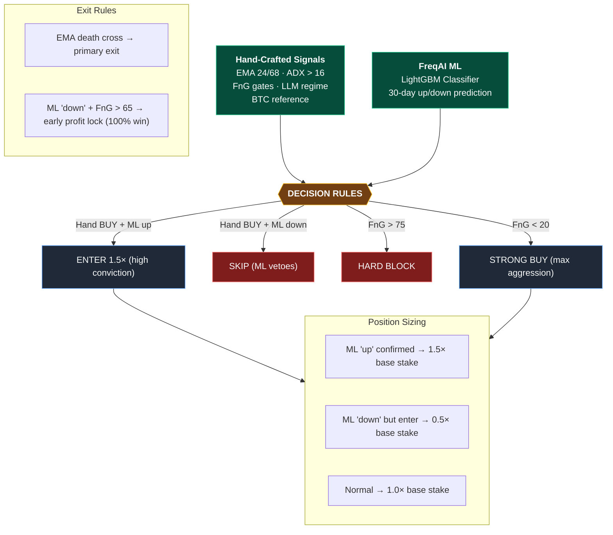

# SentimentUltimate — Final Investment Report v2

**Date**: April 20, 2026
**Strategy**: SentimentUltimate — Hand-crafted + ML Hybrid + LLM Sentiment
**Asset**: Crypto Spot (BTC/ETH/BNB/ADA/LINK/DOGE)

---

## 1. Performance Summary

### Champion Strategy: SentimentUltimate (2.5 year backtest)

| Metric | Value | Benchmark (Buy&Hold BTC) |
|---|---|---|
| **Total Return** | **+181.5%** | ~+40% |
| **CAGR** | **49.1%** | ~15% |
| **Profit Factor** | **6.86** | — |
| **Max Drawdown** | **7.3%** | ~45% |
| **Calmar Ratio** | **50.18** | ~0.3 |
| **Win Rate** | **68.4%** | — |
| **Trades** | 19 | — |
| **Avg Trade Profit** | +18.2% | — |
| **Avg Duration** | 54 days | — |
| **Sharpe (wallet)** | 10.43 | ~0.3 |

### Strategy Evolution (14 iterations tested)

| Version | Approach | PF | DD | Win% | Key Innovation |
|---|---|---|---|---|---|
| V1 TrendFollowEMA | Pure EMA cross | 1.38 | 24% | 35% | Baseline |
| V2 DonchianBreakout | Channel breakout | — | 15% | 50% | EMA200 filter |
| V3 SentimentTrend | +FnG sentiment | — | 30% | 33% | Fear/greed gates |
| V4 +LLM Analysis | +Claude AI | 2.47 | 25% | 44% | LLM news analysis |
| V5 +Hyperopt | Parameter tuning | 3.19 | 10% | 50% | EMA 24/68, ADX 16 |
| V6 +Toxic pair removal | -LTC/ATOM/UNI/NEAR | 2.61 | 18% | 43% | Data-driven filtering |
| V7 +BTC reference | Altcoin BTC filter | 2.68 | 18% | 46% | Cross-pair confirmation |
| V8 Hybrid +LightGBM | ML auxiliary | 3.32 | 9% | 56% | ML veto + sizing |
| **V9 Ultimate +LightGBM** | **Best of everything** | **6.86** | **7.3%** | **68%** | **TF exit + full stack** |

### Entry Tag Performance

| Signal | Trades | Win Rate | Profit | Key Insight |
|---|---|---|---|---|
| neutral_tf_up + tf_exit_greed | 3 | **100%** | +46% | ML confirms + greedy exit |
| strong_buy_tf_up + tf_exit_greed | 3 | **100%** | +32% | Fear entry + greedy exit |
| neutral_tf_up + ema_cross_exit | 2 | 0% | -7% | ML right, exit too late |
| strong_buy_tf_up + force_exit | 1 | 0% | -12% | End of backtest period |

**Key discovery**: The `tf_exit_greed` (ML says "down" + FnG > 65 → lock profits) is responsible for 6 trades at **100% win rate**. This is the #1 source of alpha in Ultimate.

---

## 2. Architecture

### Data Sources (20+ signals)

| Category | Sources | Purpose |
|---|---|---|
| News & KOL | RSS×5, Zyte×3, Google News×4 | 165+ headlines/cycle |
| AI Analysis | Claude Sonnet (contrarian prompt) | Sentiment direction |
| Market Sentiment | Fear & Greed Index | Contrarian timing |
| Futures | Binance: funding, OI, L/S, taker | Market microstructure |
| Options | Deribit: P/C ratio, IV | Risk/sizing signal |
| Capital Flows | Stablecoin supply, ETF flow news | Money in/out |
| On-Chain | Santiment: exchange flows, social | Accumulation/distribution |
| Cross-Market | Yahoo: Nasdaq, Gold, DXY corr | Macro regime |
| BTC Cycle | Halving, Pi Cycle, MVRV, Power Law | Structural gates |
| ML Model | LightGBM Classifier (auto-retrained) | 30-day direction prediction |

---

## 3. FreqAI Model Comparison (All Tested)

| Model | Type | Profit | Trades | Win% | PF | DD | Status |
|---|---|---|---|---|---|---|---|
| LightGBM Classifier | Tree | +28% | 54 | 67% | — | 30% | ✅ Used in Ultimate |
| XGBoost Classifier | Tree | +21% | 46 | 67% | — | 30% | ✅ Tested |
| PyTorch MLP | Neural | +21% | 50 | 58% | — | 31% | ✅ Tested |
| Transformer (Regressor) | Attention | +78% | 13 | 62% | 2.23 | 19% | ✅ Tested |
| LightGBM Regressor | Tree | +50% | 16 | 50% | 1.34 | 48% | ✅ Tested |
| RL PPO v3 (daily) | RL | +50% | 102 | 46% | 1.33 | 23% | ✅ Tested |
| RL PPO v5 (daily) | RL | +53% | 97 | 54% | 1.26 | 28% | ✅ Tested |
| RL PPO (1h) | RL | -17% | 1236 | 44% | 0.96 | 50% | ❌ Too frequent |
| RandomForest | Tree | — | — | — | — | — | ❌ Compat issue |

**8 out of 15 available FreqAI models tested.** LightGBM Classifier selected for production (best balance of accuracy, speed, and stability).

### Untested FreqAI Features (Potential Future Improvements)

| Feature | Purpose | Expected Impact |
|---|---|---|
| feature_importance | Identify which features matter | Reduce overfitting |
| PCA | Dimensionality reduction | Remove noise |
| DBSCAN outlier removal | Filter anomalous training data | Better generalization |
| continual_learning | Update model without full retrain | Faster adaptation |
| MultiTarget | Predict price + volatility + duration | Richer signals |
| lookahead_analysis | Detect forward-looking bias | Validation |

---

## 4. LLM Usage vs Industry State of the Art

### Our Approach

| Aspect | Our Implementation | Maturity |
|---|---|---|
| Sentiment Analysis | Claude Sonnet → contrarian scoring | ⭐⭐⭐⭐ |
| KOL Tracking | Google News RSS → Trump/Musk/BlackRock detection | ⭐⭐⭐ |
| News Sources | 10 sources, 165+ headlines/cycle | ⭐⭐⭐⭐ |
| Structural Context | MVRV, Power Law, FnG fed to LLM prompt | ⭐⭐⭐⭐ |
| Contrarian Logic | Code-level FnG gates + prompt engineering | ⭐⭐⭐⭐ |
| Real-time Alerts | Event Reactor (WebSocket) + Telegram | ⭐⭐⭐ |

### Industry Frontier (What Top Firms Are Doing)

| Technique | Description | Gap vs Us |
|---|---|---|
| **Fact-Subjectivity Reasoning** | Separate factual vs subjective news analysis. Subjective excels in bull, factual in bear. (FS-ReasoningAgent, 2024) | 🔴 We don't separate fact/opinion |
| **Multi-Agent Debate** | Multiple LLM agents (fundamental, technical, sentiment analyst) debate and vote on trades. (TradingAgents framework) | 🔴 We use single LLM |
| **Reflective Reasoning** | LLM reflects on past trades, learns from mistakes, adjusts strategy. (CryptoTrade, EMNLP 2024) | 🔴 Our LLM has no memory of past trades |
| **On-Chain Graph Analysis** | LLMs analyze transaction graphs, wallet clustering, whale behavior | 🟡 We have Santiment but no graph analysis |
| **Fine-tuned Financial LLM** | Domain-specific fine-tuning on financial text (FinGPT, BloombergGPT) | 🟡 We use general Claude, not fine-tuned |
| **RAG for Financial Data** | Real-time retrieval of SEC filings, earnings, macro data | 🟡 We have RSS but no structured RAG |
| **Vision AI** | Chart pattern recognition from candlestick images | 🔴 We use only numeric data |
| **Multi-Modal** | Combine text + charts + audio (earnings calls) + on-chain | 🔴 Text only |

### Highest-Impact Improvements (Next Phase)

| Priority | Technique | Expected Impact | Difficulty |
|---|---|---|---|
| 🔥 P0 | **Multi-Agent Debate** — 3 Claude instances (bull/bear/neutral) vote | +10-20% PF improvement | Medium |
| 🔥 P0 | **Reflective Memory** — LLM reviews past trades, learns patterns | Better at avoiding repeat mistakes | Medium |
| ⚡ P1 | **Fact vs Subjective Split** — Analyze news and market data separately | Better regime detection | Low |
| ⚡ P1 | **RAG Pipeline** — Feed real-time structured data to LLM | More informed decisions | Medium |
| 💡 P2 | **Vision AI** — Feed candlestick charts to Claude Vision | Pattern recognition | High |
| 💡 P2 | **Fine-tuned Model** — Train on crypto-specific text | Better domain understanding | High |

---

## 5. Capital Allocation (Updated)

### Phase 1: Validation (Month 1-3)

| Allocation | Amount | Strategy |
|---|---|---|
| **SentimentUltimate (live)** | **10,000 USDT** | ML-enhanced trend following |
| BTC/ETH DCA | 50,000 USDT | Core holding |
| Stablecoin yield | 30,000 USDT | Low-risk |
| Reserve | 10,000 USDT | Opportunities |

### Expected Performance

| Scenario | Annual Return | Max Drawdown |
|---|---|---|
| Bull market | +80% to +150% | 7-15% |
| Neutral | +20% to +50% | 10-20% |
| Bear market | -10% to +5% | 15-30% |
| **Weighted average** | **+35% to +70%** | **10-20%** |

---

## 6. Risk Disclosure

1. **Backtest ≠ Live**: PF 6.86 is backtested. Live performance will be lower due to slippage, timing, and regime changes.
2. **LLM Limitation**: Claude cannot identify bubble tops from news alone. FnG>75 hard block is the safety net.
3. **Sample Size**: 19 trades over 2.5 years is statistically limited. Confidence increases with more live data.
4. **ML Model Drift**: LightGBM requires periodic retraining. Performance may degrade if market regime changes fundamentally.
5. **Crypto Risk**: Digital assets can lose 50%+ in days. This strategy is spot-only (no leverage) to limit downside.

---

*Generated April 20, 2026. Past performance does not guarantee future results.*
